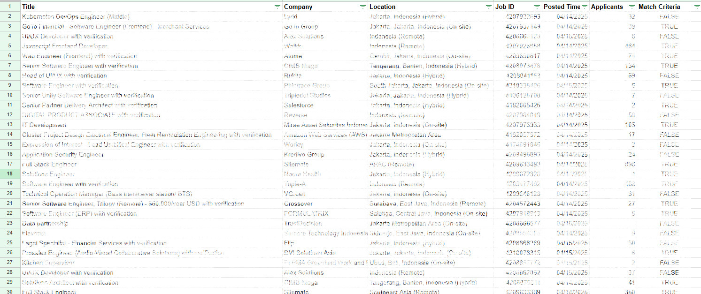

# Linkedin Surf

A Chrome extension that automates job searches on LinkedIn for Frontend Engineer roles in Indonesia. It helps eliminate duplicates and off-target postings, focusing on onsite roles. In addition, it leverages the OpenAI API to quickly determine if job listings match personalized conditions.

## Rationale

While searching for jobs on LinkedIn, I encountered two major pain points:

- **Repetitiveness**: After browsing several pages (especially page 5 and beyond), I found too many repetitive job postings, which slowed down the process significantly.
- **Irrelevant Listings**: Many job listings did not match my target role—even when filtered by standard criteria, roles that I wasn't interested in would still show up.

To address these issues, I created this extension. It automatically scrolls through the job listings, removes duplicate postings, and uses predefined keyword filters along with the OpenAI API to ensure only the most relevant jobs (e.g., frontend, fullstack, tech lead roles, and similar) are presented. This streamlines the job search process by quickly delivering a curated list of matching jobs.

## Features

- **Auto-scrolls job listings** to load all results.
- **Extracts job details**: title, company, location, URL.
- **Filters jobs based on**:
  - Title keywords (includes frontend, fullstack, etc.)
  - Location (must be in Indonesia, excludes remote/hybrid)
- **AI-Powered Job Matching**: Uses OpenAI API to determine if job listings match user-specified conditions.
- **Removes duplicates**.
- **Exports filtered results to CSV**.

## Installation

1. Clone this repository or download it as a ZIP file.
2. Open Chrome and navigate to `chrome://extensions/`.
3. Enable "Developer mode" (toggle in the top-right corner).
4. Click "Load unpacked" and select the directory containing the extension files.
5. The LinkedIn Job Filter extension should now appear in your extensions list.

## Usage

1. Go to a LinkedIn job search page (e.g., `https://www.linkedin.com/jobs/search/...`).
2. Click on the extension icon in your browser toolbar.
3. Input your preference
  
4. Click "Start Filtering Jobs" in the popup.
5. Wait while the extension scrolls through and processes all job listings.
6. When finished, a CSV file with the filtered jobs will be downloaded automatically.
  Example csv:
  

## Configuration

You can customize the filter keywords by editing the `config` object in `content.js`:

```javascript
const config = {
  // Title filters (case insensitive)
  includeKeywords: ['frontend', 'front-end', 'front end', ...],
  excludeKeywords: ['designer', 'mechanical', ...],
  // Location filters
  locationRequirements: ['indonesia'],
  // Max jobs to process per page
  maxJobs: 500,
  // Max pages to process
  maxPages: 3
};
